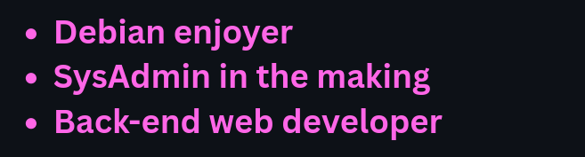

## Tristan alias Tritryi 




### About me
I am an undergraduated french student majoring in system administration, network and security. I also love development especially for some personal projects. 

I enjoy web development and a bit of scripting like Python or PHP.

The main languages I use are PHP, Bash, Python, and a bit of C/C++. I mainly work on Debian systems especially since Debian 13 release.

### Some facts...

```
user@debian:~$ ps aux | grep "current-activities"
NAME                        ACTIVITY
working-on                  a discord bot
learning                    discord python API

user@debian:~$ give-fun-facts
1. I hardly start personal projects but when I do I can spend my whole day on it

2. I want to become a teacher someday
```

### My skills

#### Programming languages

        

#### Databases
 

#### Tools
    	 

#### Frameworks
 

#### Languages spoken


<!--
**Tritryi/Tritryi** is a ✨ _special_ ✨ repository because its `README.md` (this file) appears on your GitHub profile.

Here are some ideas to get you started:

- 🔭 I’m currently working on ...
- 🌱 I’m currently learning ...
- 👯 I’m looking to collaborate on ...
- 🤔 I’m looking for help with ...
- 💬 Ask me about ...
- 📫 How to reach me: ...
- 😄 Pronouns: ...
- ⚡ Fun fact: ...
-->
